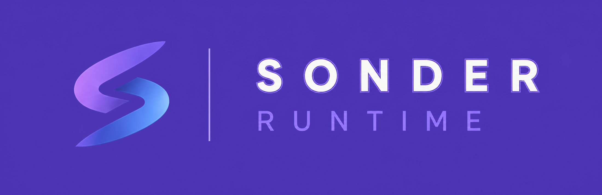
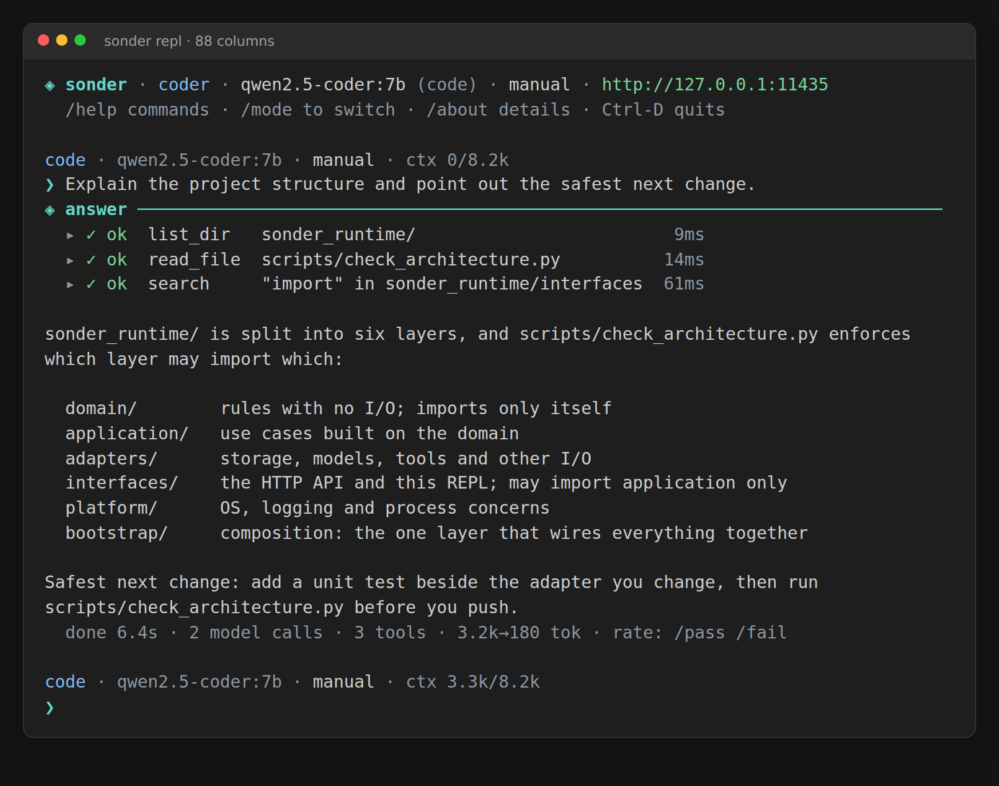

# Sonder Runtime

<p align="center">
  
</p>

<p align="center"><strong>Your models. Your memory. Your machine.</strong></p>

Sonder is a private, adaptive AI runtime that brings models, memory, tools,
agents, and optional training into one local-first system. It runs around an
Ollama model rather than shipping model weights itself, so you can choose the
model and hardware that fit your needs.

<!-- ci-artifact-badges:start -->
[](https://github.com/Krilliac/Sonder-runtime/releases/tag/app-latest)
[](https://github.com/Krilliac/Sonder-runtime/releases/download/app-latest/sonder-runtime-android.apk)
[](https://github.com/Krilliac/Sonder-runtime/releases/download/app-latest/sonder-runtime-linux-x64.tar.gz)
[](https://github.com/Krilliac/Sonder-runtime/releases/download/app-latest/sonder-runtime-windows-x64.zip)
[](https://github.com/Krilliac/Sonder-runtime/releases/download/app-latest/sonder-runtime-macos.zip)
<!-- ci-artifact-badges:end -->

## Why Sonder

- **Private by default.** Local models, embeddings, memory, and tools stay on
  your machine. Web, remote Ollama, and cloud tiers require separate opt-ins.
- **Learns from real outcomes.** Sonder stores what worked after a compile,
  test, or user judgment, then retrieves relevant lessons for later work.
- **Useful beyond chat.** Guarded file tools, code execution, repository
  inspection, research, artifacts, and bounded agent fleets share one runtime.
- **Model and hardware agnostic.** Use the Ollama model that fits your CPU,
  NVIDIA/AMD/Intel GPU, Apple unified memory, or mixed-device setup.
- **Available where you work.** Use the desktop/mobile app, terminal REPL,
  OpenAI-compatible API, MCP tools, or a private remote server.
- **Inspectable and recoverable.** Activity evidence, policy gates, backups,
  transactional operations, and rollback paths are built into the workflow.

## How it fits together

```text
App / terminal / API / MCP
            |
            v
Sonder Runtime
policy + memory + tools + agents + training control
            |
            v
Ollama
model storage + CPU/GPU inference
```

- **Retrieval** — hybrid lexical (SQLite FTS5) + semantic (local embeddings), with a **relevance threshold** so only genuinely on-topic lessons are injected (irrelevant lessons hurt, so it injects nothing when nothing fits).
- **Capture** — every learning call is logged locally to `memory.db`.
- **Grounding** — you (or your fleet) call `record_outcome` with a real signal; execution outcomes are the reward.
- **Reflection** — a good outcome distills a deduped one-line lesson future prompts can retrieve.

The loop is model-agnostic: point it at a compatible Ollama model. The selected
local `code` model is memory-augmented; a stronger paid/cloud model can answer
without local-lesson injection while its grounded good outcomes are distilled into
lessons and fine-tuning data the local model retrieves later. Which
tiers learn is configurable (`SONDER_LEARN_TIERS`, default local aliases:
`fast,code,general`). Memory, capture, and distillation stay on the runtime host.
A cloud-tier prompt leaves only after `SONDER_ALLOW_CLOUD=1`. The `fast`, `code`,
and `general` aliases use loopback Ollama by default; pointing `OLLAMA_HOST` at a
non-loopback server is blocked unless `SONDER_ALLOW_REMOTE_OLLAMA=1` explicitly
acknowledges that prompts and embeddings leave this machine. Remote Ollama and
hosted/cloud consent are separate gates. Their shared mappings
and each execution lane's preferred alias live in the hot-reloadable runtime
policy described below. Environment values seed the first policy file; cloud
aliases and cloud opt-in remain separate host-owned configuration.

Loopback model requests use one bounded, same-model retry by default for narrowly
transient transport failures and HTTP 408/429/502/503/504 responses. The retry
shares the original timeout budget, checks fleet cancellation before resending,
and never changes endpoint, model, or tier. Hosted/cloud calls are always
single-attempt to avoid silently duplicating metered work. Set
`SONDER_LOCAL_RETRIES=0..2` and `SONDER_LOCAL_RETRY_DELAY_MS=0..1000` to tune the
loopback policy. Explicit remote Ollama and hosted/cloud calls are single-attempt.

One extra attempt exists on top of that policy, and only for a *classified*
context overflow. The gateway reads the failure text - never the HTTP status,
which providers and proxies get wrong often enough that a real overflow can
arrive as a 429 - and if it says the prompt did not fit, a loopback call may
compact the prompt once and resend it inside the same timeout and cancellation
budget. Compaction drops the oldest turns and leaves a short in-band note, the
same discipline the session live-turn window already uses; it never rewrites or
truncates a message, and it never raises `num_ctx` behind the context policy's
back. A request that is one oversized turn has nothing safe to drop and is
reported rather than retried. Body-too-large, device out-of-memory, plain rate
limits, and missing models are recognised as explicitly *not* overflow and are
never retried this way. Hosted and remote routes keep their single-attempt
posture unless the call site declares the request idempotent **and**
`SONDER_HOSTED_OVERFLOW_RETRY=1` is set.
Good-outcome lesson reflection does not queue another model request behind an
active fleet: the outcome is committed immediately and its lesson remains
retryable. When the fleet is idle, reflection uses a separate shared generation
and embedding budget (`SONDER_DISTILLATION_TIMEOUT`, default `20` seconds,
bounded by `SONDER_TIMEOUT`) so `record_outcome` cannot inherit the normal
five-minute model-call ceiling.

Sonder is a runtime, not a foundation model. Names such as
`sonder:latest` are local Ollama aliases; the underlying weights remain managed
by Ollama. Ollama is the local model server.

## Model requirements

You do **not** need every model or every tier in the catalog.

| What you want to use | What must be available locally |
|---|---|
| Normal REPL, API chat, and code work | Ollama plus one generative local model. Bootstrap or `setup_alias.py` chooses/pulls that base model and exposes it as `sonder:latest`. The `fast`, `code`, and `general` roles can all share it. |
| Semantic memory, lesson recall, and vector search | An embedding model as well (the bootstrap default is `nomic-embed-text`). Core chat still starts without one, but those semantic features are unavailable until an embedding model is configured. |
| Image or screenshot analysis | An explicitly configured local vision-language model; it is only needed when using a vision-capable feature. |
| Separate reasoning, reranking, extraction, tool-oriented, speech, or experimental model families | Optional specialist models. Install and bind them only when the matching feature is enabled and supported. |
| Cloud tiers | No local download, but explicit cloud opt-in is required and prompts leave the machine for those calls. |

The bootstrap and `setup_alias.py` intentionally **try** to pull both a base
model and the default embedding model so a new local installation has memory
enabled out of the box. The generative base model is required; if the optional
embedding pull is unavailable, bootstrap still creates `sonder:latest` and
explains how to enable recall/lessons later. See the
[Model Catalog](docs/wiki/18-model-catalog.md) for tier bindings and the
[collection runbook](docs/runbooks/assemble-model-collection.md) for specialist
setups. Use `setup_alias.py --no-embedding` when you intentionally want the
smallest chat-only installation.

> Installing a tag only puts a model in Ollama's catalog; it does not by itself
> enable a Sonder feature. Bind supported models through `/runtime set ...` and
> use the matching tool or route. A downloaded speech or reranker tag remains
> optional until Sonder has a provider-backed integration for that capability.

## Quick start

The `app-latest` badges are a mutable prerelease snapshot. They may lag `main`
and are not a versioned, release-ready build. Versioned `app-vX.Y.Z` releases
must pass the repository's version, artifact-integrity, SBOM, and provenance
gates.

### Packaged app or bundled runtime

Run the one-time bootstrap from the extracted bundle. It starts Ollama and
chooses a compatible local model. A bundle is intentionally self-contained:
it does **not** modify your shell `PATH`. Use its launcher directly, or add
the bundle directory to `PATH` yourself if you want to invoke `sonder` by
name in later terminals.

```powershell
# Windows PowerShell, from the installed bundle
.\bootstrap-engine.cmd
.\sonder.cmd
```

```bash
# Linux/macOS, from the installed bundle
./bootstrap-engine.sh
. ./sonder-runtime.sh
"$SONDER_PYTHON" ./sonder_repl.py
```

### From source

Install and start [Ollama](https://ollama.com) first. The following command
blocks create a virtual environment, install the runtime, configure the local
`sonder` model alias, and open the REPL.

```bash
# Linux/macOS
git clone https://github.com/Krilliac/Sonder-runtime.git
cd Sonder-runtime
python3 -m venv venv
./venv/bin/pip install -r requirements-runtime.txt
./venv/bin/python setup_alias.py
./venv/bin/python -m sonder_runtime repl
```

```powershell
# Windows PowerShell
git clone https://github.com/Krilliac/Sonder-runtime.git
Set-Location Sonder-runtime
python -m venv venv
.\venv\Scripts\pip.exe install -r requirements-runtime.txt
.\venv\Scripts\python.exe setup_alias.py
.\venv\Scripts\python.exe -m sonder_runtime repl
```

For a Linux loopback service install that provisions Ollama, its local model,
and systemd in one step, run `bash deploy_sonder.sh --serve` as root from a
source checkout. Use the production installer and TLS runbook for non-loopback
hosting.

### Launch and use

After an installation has added a `sonder` launcher to your `PATH`, simply
type `sonder` in Bash or PowerShell. (On Windows, `sonder` resolves to
`sonder.cmd`; an extracted bundle alone is not a `PATH` installation.) From a
source checkout or an extracted POSIX bundle, use the explicit command below.
In either case, ask normally; type `/help` for guarded commands and use the
visible composer shortcuts for history and editing.

```bash
sonder
# or, from this source checkout:
python -m sonder_runtime repl
# sonder > explain this repository's test layout
```

<p align="center">
  
</p>

The terminal REPL keeps the current model, active lanes, context budget, token
usage, and elapsed time visible while you work. Type normally, use `/help` to
discover guarded commands, and use `/model <tag-or-tier>` to choose an
installed chat model.

### Check or update this source checkout

The REPL banner shows its loaded and newest known source revisions without
network I/O. Use `/updatecheck` to refresh the canonical `origin/main` ref and
report the installed/newest commit and timestamps. `/update` is a guarded
fast-forward for a clean checkout on `main` with the canonical Sonder remote;
it refuses feature branches, local commits, and dirty trees. Restart Sonder
after a successful source update. These REPL commands are separate from the
signed release-manager commands documented in the update guide.

If local workflow edits make a source checkout dirty, `/stash` shows the
recovery state; `/stash save` preserves tracked edits, `/stash save-untracked`
also preserves generated files, and `/stash pop` restores the most recent
recovery stash only onto a clean canonical `main` checkout. Saved workflows
now live in the normal per-user state directory (for example,
`%LOCALAPPDATA%\sonder\workflows.json` on Windows), so new workflow saves no
longer dirty an installed source tree. Existing root `workflows.json` files are
copied once on first use; the original is left untouched for review.

Start the loopback OpenAI-compatible API in a second terminal when another
client needs it. Run `doctor` first if this is a new machine.

```bash
python -m sonder_runtime doctor
python -m sonder_runtime serve
curl http://127.0.0.1:11435/v1/chat/completions \
  -H "Content-Type: application/json" \
  -d '{"model":"sonder","messages":[{"role":"user","content":"Hello"}]}'
```

```powershell
# PowerShell equivalent (run after `python -m sonder_runtime serve`)
$body = @{
  model = "sonder"
  messages = @(@{ role = "user"; content = "Hello" })
} | ConvertTo-Json -Depth 4
Invoke-RestMethod http://127.0.0.1:11435/v1/chat/completions `
  -Method Post -ContentType "application/json" -Body $body
```

For a source checkout, prefix the commands with the venv Python shown above;
for example `./venv/bin/python -m sonder_runtime serve` or
`.\venv\Scripts\python.exe -m sonder_runtime serve`. For an MCP client, run
`python -m sonder_runtime mcp`. See the
[getting-started guide](docs/wiki/02-getting-started.md),
[HTTP API reference](docs/wiki/05-http-api-and-lifecycle.md), and
[CLI reference](docs/wiki/04-cli-and-entrypoint.md) for configuration,
authentication, hosting, and full command details.

## What you get

| Area | Highlights |
|---|---|
| Models | Local fast/code/general tiers, explicit cloud fallbacks, model routing |
| Memory | Hybrid retrieval, project scoping, grounded lessons, preferences |
| Tools | Guarded files, repositories, code, data, web, artifacts, office formats |
| Agents | Single agent, durable autopilot, bounded parallel fleets, cancellation |
| Apps | Windows, Linux, macOS, Android, terminal, API, and MCP clients |
| Operations | Activity evidence, backups, recovery, signed updates, live reload |
| Personalization | Optional adapter training with validation, deployment, and rollback |

## Honest boundaries

- A small local model is not a frontier model. Give it the facts, delegate
  bounded transformations, and review its work.
- Learning is grounded only when a caller records a real outcome; self-graded
  success is not treated as proof.
- Remote access is powerful because Sonder can execute code and modify files.
  Never expose the convenience loopback service directly to a network.
- Deliberately unrestricted model testing is available only through the
  exact-acknowledgement [unsafe lab runbook](docs/runbooks/unsafe-lab.md). It
  removes model-loop host-tool policy; it does not provide OS isolation.
- NPU support is an optional utility path for compatible routing or embedding
  work; token generation remains on the model server's CPU/GPU path.

## Documentation

- [Getting started](docs/wiki/02-getting-started.md)
- [Architecture](ARCHITECTURE.md)
- [Configuration](docs/wiki/03-configuration.md)
- [Agent, autopilot, and fleets](docs/wiki/07-agent-autopilot-fleet.md)
- [Models and gateways](docs/wiki/08-model-tiers-and-gateway.md)
- [Tools and languages](docs/wiki/10-tools-and-languages.md)
- [Natural-language tool calling](docs/NATURAL_LANGUAGE_TOOLS.md)
- [Training](TRAINING.md)
- [Client and private hosting](CLIENT.md)
- [Unsafe lab model testing](docs/runbooks/unsafe-lab.md)
- [Runbooks](docs/runbooks/README.md)
- [Full wiki](docs/wiki/README.md)

## Security and contributing

Read [SECURITY.md](SECURITY.md) before enabling remote access. Use the
server-private profile behind TLS and report vulnerabilities privately through
GitHub's Security tab.

Optional direct MCP container execution is documented in
[docs/security/ISOLATED_EXECUTION.md](docs/security/ISOLATED_EXECUTION.md). It
uses a fixed Docker/Podman policy and is stronger than local `run_code`, but it
still relies on the external runtime and host kernel and is not escape-proof.

Contributions are welcome under the [Apache License 2.0](LICENSE). See
[CONTRIBUTING.md](CONTRIBUTING.md) for the development and review workflow.
