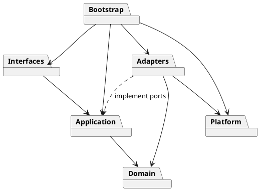
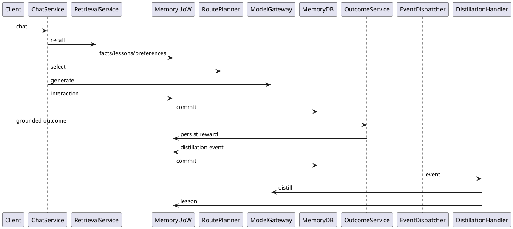
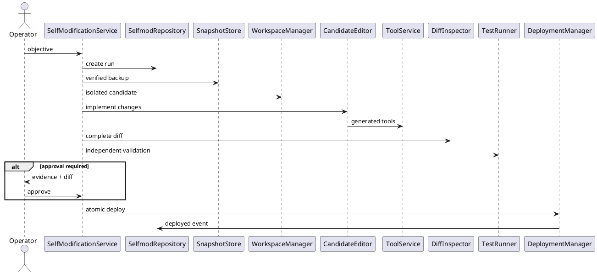
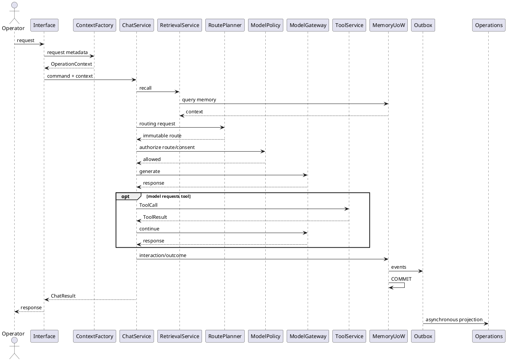

# SPEC-5-Sonder-Runtime-End-State-Architecture

> **Superseded as an implementation plan.** This document is retained as the approved
> historical design record. Current requirements, sequencing, checkboxes, references,
> and completion evidence live in
> [`SONDER-MASTER-IMPLEMENTATION-SPEC.md`](SONDER-MASTER-IMPLEMENTATION-SPEC.md).
> If the documents conflict, the master implementation specification wins.

**Status:** Approved for implementation  
**Target:** Sonder Runtime end-state architecture  
**Deployment model:** Single trusted operator; workstation or privately controlled server  
**Compatibility policy:** Preserve user data and useful capabilities; remove legacy code and interfaces completely  
**Supersedes:** SPEC-3's compatibility/strangler-migration end state  
**Preserves:** SPEC-2 production-readiness capabilities and SPEC-4 signed-update capabilities unless explicitly changed below

---

## Background

Sonder Runtime is a private-first AI orchestration runtime built around local inference. Ollama remains an external inference/model-management service while Sonder owns routing, memory, retrieval, model-facing tools, agents, automation, grounding, API/MCP/REPL surfaces, training lifecycle, and other host-runtime concerns.

The repository is already partway through a SPEC-3 migration from a large collection of root-level Python modules to a layered modular monolith under:

```text
sonder_runtime/
├── domain/
├── application/
├── adapters/
├── platform/
└── bootstrap/
```

The existing direction is sound: domain rules are pure, application code depends on ports, adapters own I/O, and bootstrap is the composition root. However, SPEC-3 intentionally retained root compatibility delegates and `adapters/legacy` while call sites were migrated incrementally. The repository still identifies memory, execution, training, thin transports, and legacy-import removal as unfinished work.

SPEC-5 changes the objective.

The final system does **not** need permanent backward-compatible internal interfaces. Sonder is not being designed as a public multi-tenant SaaS API shared among unrelated users. It is designed primarily for one trusted operator on a workstation or privately controlled server.

Therefore:

> **Legacy compatibility is not an architectural objective. Legacy implementations, delegates, imports, environment bypasses, and duplicate execution paths are to be removed completely.**

The migration must preserve important existing user state and capabilities, but it does not preserve obsolete Python APIs merely because old internal modules use them.

The repository already has substantial production-hardening work that must survive the refactor: health/readiness, lifecycle/drain behavior, structured operations, database migrations, backup/restore, configuration and secret handling, metrics, packaging, and signed update/rollback infrastructure. SPEC-2 is reported implemented, while SPEC-4 has an implemented Linux reference signed-update engine based on `updates.db`, TUF verification, backups, health gates, atomic activation, and rollback.

The repository also has approximately 2,500 tests serving as its current behavioral baseline. These tests are migration evidence, not a requirement to preserve legacy implementation details. Legacy-specific assertions may be deleted or replaced when the corresponding behavior is intentionally superseded.

### Design Goal

Produce one understandable, private-first, directly maintainable Sonder Runtime where:

```text
interfaces
    ↓
application use cases
    ↓
domain rules + ports
    ↓
adapters
    ↓
SQLite / Ollama / containers / filesystem / Git / network
```

and where there is exactly one authoritative implementation path for every core capability.

The resulting system must be implementable by a small contractor team without requiring microservices, Kubernetes, distributed databases, brokers, or a compatibility framework.

---

## Requirements

Requirements use MoSCoW prioritization.

### Must Have

- **M1 — One authoritative runtime package.** Production business behavior must live under `sonder_runtime/`.

- **M2 — Complete legacy removal.** Root-level business-module delegates, `adapters/legacy`, compatibility wrappers, deprecated singleton/application factories, obsolete environment capability checks, and alternate implementations must be deleted when their replacement slices are complete.

- **M3 — Preserve data, not obsolete interfaces.** Existing operator data must have an explicit migration/adoption path. Internal Python import compatibility is not required.

- **M4 — Modular monolith.** Sonder remains one deployable runtime with strongly enforced internal boundaries. No service decomposition is required.

- **M5 — Private/local by default.** Local models, local memory, local embeddings, local tools, and private state remain the normal configuration.

- **M6 — Single trusted operator.** One operator owns the runtime. Multi-tenant data partitioning and tenant authorization are out of scope.

- **M7 — Explicit domain ownership.** Every persistent bounded domain has one repository owner, migrations, and transaction semantics.

- **M8 — Per-domain SQLite.** Use separate SQLite databases rather than a shared application database.

- **M9 — No cross-database business transactions.** Domains coordinate through application workflows and durable events.

- **M10 — Transactional outbox.** Every state-owning domain must atomically persist state changes and its durable events.

- **M11 — Thin inbound interfaces.** HTTP, MCP, CLI, and REPL perform protocol translation and invoke application services; they do not implement workflows.

- **M12 — One inference path.** All model generation uses the same `ModelGateway` contract.

- **M13 — One deterministic route planner.** Routing decisions are pure domain logic and never perform model or network I/O.

- **M14 — Preserve logical model tiers.** Retain `fast`, `code`, `general`, `reasoning`, and `vision`.

- **M15 — Preserve logical lanes.** Retain `router`, `workbench`, `autopilot`, `fleet`, and `review`.

- **M16 — No automatic local-to-cloud fallback.** Hosted inference may occur only because an allowed request explicitly selected a hosted route.

- **M17 — One model-to-host tool gateway.** Model-authored tool calls pass through `ToolService`.

- **M18 — Containerized generated execution by default.** Generated code, generated tests, and normal guarded self-modification use Docker or Podman isolation by default.

- **M19 — Explicit startup-only unrestricted tool authority.** `--unrestricted-tools` removes normal model/agent host-tool authorization restrictions.

- **M20 — Explicit startup-only unrestricted self-modification authority.** `--unrestricted-selfmod` grants the self-modification subsystem unrestricted authority within the OS user's permissions.

- **M21 — Independent unrestricted capabilities.** `--unrestricted-tools` and `--unrestricted-selfmod` must remain independent flags.

- **M22 — Immutable capability configuration.** Neither capability can be enabled through HTTP, MCP, model output, an automation run, or another runtime command after process startup.

- **M23 — Reliability controls remain under unrestricted modes.** Deadlines, cancellation, process cleanup, output bounds, operation IDs, and logging remain active even where authorization gates are disabled.

- **M24 — Guarded self-modification remains available by default.** Normal selfmod uses isolated candidate changes, evidence, testing, approval where required, backups, atomic deployment, and recovery.

- **M25 — Unrestricted self-modification means unrestricted.** When `--unrestricted-selfmod` is supplied, application-level selfmod path, approval, scope, test-success, Git, dependency, deployment, and restart restrictions may be bypassed.

- **M26 — Operating-system permissions are the ultimate unrestricted boundary.** Sonder must not claim that its audit database or recovery files form a security boundary against a process explicitly granted unrestricted selfmod.

- **M27 — Adapter training remains first-class.** Training is not removed during the refactor.

- **M28 — Training remains attended-only.** Neither unrestricted startup flag grants permission to autonomously initiate long-running training.

- **M29 — Immutable trained deployments.** New trained models use immutable deployment identities; runtime policy selects which identity is active.

- **M30 — Training cannot activate itself.** Only `DeploymentService` may change active routing after validation.

- **M31 — Signed updates remain first-class.** Existing signed-update, backup, activation, health-check, and rollback capabilities survive the refactor under a bounded `updates` domain. SPEC-4 already provides an implemented signed update engine and state database that must not be discarded.

- **M32 — Preserve observability and recovery.** Health, metrics, structured operations, migrations, backup/restore, redaction, graceful shutdown, and dependency status survive restructuring. Existing SPEC-2 already implements these foundations.

- **M33 — No import-time infrastructure side effects.** Importing runtime modules must not open databases, create directories, read mutable configuration, start threads, perform network requests, or spawn processes.

- **M34 — Domain and application layers are infrastructure-free.** No SQLite, `subprocess`, direct sockets/HTTP clients, filesystem mutation, or environment reads.

- **M35 — Typed domain error boundary.** Adapter/infrastructure exceptions are converted before crossing into application/domain code.

- **M36 — Automated architecture enforcement.** CI rejects forbidden imports, cycles, raw infrastructure usage outside adapters, root business modules, and reintroduction of legacy imports.

- **M37 — Migration must be crash-safe.** Database/state migration requires a verified backup before destructive steps.

- **M38 — Final architecture checker has zero legacy exceptions.**

### Should Have

- **S1 — Typed immutable command/result DTOs** between interfaces and application services.

- **S2 — Compare-and-set revisions** on persistent workflow/state-machine aggregates.

- **S3 — Cancellation propagated through model calls, tools, automation, training subprocess supervision, and update operations. Existing program status identifies incomplete model-call cancellation propagation as a current limitation.

- **S4 — Explicit typed configuration** constructed at bootstrap instead of repeated environment access.

- **S5 — Independent backup/restore verification** for each state database.

- **S6 — Structured operation/event correlation** from inbound request through inference, tools, persistence, training, selfmod, and updates.

- **S7 — Immutable artifact hashes** for training, selfmod snapshots, and update bundles.

- **S8 — Local descriptive Git commits** after successful guarded selfmod deployment when and only when the starting checkout was clean.

- **S9 — No automatic Git push** from guarded selfmod.

- **S10 — Platform-specific signed-update activation helper** for Windows/macOS to complete the existing SPEC-4 gap. The current update engine reports its pointer switch as portable but its helper-process self-replacement path as Linux-tested only.

- **S11 — Upgrade MCP to current SDK generation** as part of deleting legacy transport assumptions. The official MCP Python SDK documentation identifies v2 as the current stable line, while v1 documentation points users to v2.

- **S12 — A qualified, exact training dependency lock** separate from normal runtime dependencies.

### Could Have

- **C1 — Additional inference providers** behind `ModelGateway`.

- **C2 — NPU utility acceleration** for routing/embeddings behind an accelerator adapter. The existing policy intentionally treats NPU capabilities as utilities below the generative tiers rather than a model tier.

- **C3 — Additional container engines** if they implement the same execution contract.

- **C4 — Speculative execution optimizations** only when deployment-specific metrics demonstrate an end-to-end benefit. Existing project measurements report approximately no end-to-end benefit in the CPU sandbox despite useful prediction behavior.

- **C5 — Additional training backends** behind `TrainingBackend`.

### Won't Have

- **W1 — Permanent compatibility shims.**

- **W2 — Permanent `adapters/legacy`.**

- **W3 — Root-level business-module delegates.**

- **W4 — Two production implementations of the same domain.**

- **W5 — Multi-tenant SaaS architecture.**

- **W6 — Microservices introduced solely for separation.**

- **W7 — Kafka, RabbitMQ, Redis Streams, or another external broker for local domain events.**

- **W8 — Distributed SQL transactions.**

- **W9 — Automatic cloud failover after local inference failure.**

- **W10 — Runtime commands that enable unrestricted capabilities after startup.**

- **W11 — A single vague `--dangerous` flag.**

- **W12 — A permanent `--unsafe-lab` capability name.**

- **W13 — Mutable `sonder-personal:latest` as the canonical identity of newly trained deployments.**

- **W14 — Autonomous training merely because unrestricted host access was enabled.**

- **W15 — Automatic remote Git push from self-modification.**

---

## Method

### 1. End-State Package Architecture

The final runtime package is:

```text
sonder_runtime/
├── domain/
│   ├── common/
│   ├── runtime_policy/
│   ├── routing/
│   ├── memory/
│   ├── execution/
│   ├── automation/
│   ├── training/
│   ├── selfmod/
│   └── updates/
│
├── application/
│   ├── context.py
│   ├── ports/
│   ├── chat/
│   ├── agents/
│   ├── memory/
│   ├── execution/
│   ├── automation/
│   ├── training/
│   ├── selfmod/
│   ├── updates/
│   └── operations/
│
├── adapters/
│   ├── inference/
│   │   ├── ollama.py
│   │   └── openai_compat.py
│   ├── persistence/
│   │   └── sqlite/
│   │       ├── memory.py
│   │       ├── automation.py
│   │       ├── training.py
│   │       ├── selfmod.py
│   │       ├── operations.py
│   │       └── updates.py
│   ├── execution/
│   │   ├── container.py
│   │   └── host.py
│   ├── filesystem/
│   ├── git/
│   ├── web/
│   ├── training/
│   ├── updates/
│   ├── accelerators/
│   │   └── npu/
│   └── observability/
│
├── interfaces/
│   ├── cli/
│   ├── repl/
│   ├── http/
│   └── mcp/
│
├── platform/
│   ├── config.py
│   ├── paths.py
│   ├── secrets.py
│   ├── metrics.py
│   ├── lifecycle.py
│   ├── shutdown.py
│   └── version.py
│
└── bootstrap/
    ├── capabilities.py
    ├── container.py
    └── main.py
```

The current package contains the first five high-level package families but not the proposed `interfaces/` layer; SPEC-5 makes inbound interfaces an explicit architectural boundary.

### 2. Dependency Direction



Enforce:

```text
domain
  → stdlib + domain only

application
  → domain + application ports
  → no adapter imports
  → no environment access
  → no infrastructure I/O

interfaces
  → application
  → protocol libraries
  → no repositories or infrastructure implementations

adapters
  → application ports
  → domain DTOs/errors
  → platform infrastructure

platform
  → generic host/runtime infrastructure
  → no business use cases

bootstrap
  → may import all layers
  → sole dependency-composition location
```

The existing architecture checker already detects forbidden layer edges, package cycles, SQLite outside adapters, subprocess use outside adapters, network modules outside adapters, and environment reads in domain/application. SPEC-5 extends rather than replaces this mechanism.

### 3. Composition Root

There is one authoritative construction path:

```python
def build_runtime(
    config: RuntimeConfig,
    capabilities: RuntimeCapabilities,
) -> Runtime:
    ...
```

No `default_app()` compatibility singleton.

No lazy global database owner.

No hidden environment-based policy selection inside business modules.

The composition root constructs:

```text
validated config
runtime capabilities
database factories
repositories/UoWs
model gateways
container/host executors
tool policies
filesystem/Git adapters
training backend
update adapters
application services
interfaces
```

### 4. Runtime Capabilities

Approved startup flags:

```bash
sonder
sonder --unrestricted-tools
sonder --unrestricted-selfmod
sonder --unrestricted-tools --unrestricted-selfmod
```

Model:

```python
from dataclasses import dataclass

@dataclass(frozen=True)
class RuntimeCapabilities:
    unrestricted_tools: bool = False
    unrestricted_selfmod: bool = False
```

Capability matrix:

| Invocation | General model tools | Self-modification |
|---|---|---|
| `sonder` | Guarded | Guarded |
| `sonder --unrestricted-tools` | Unrestricted | Guarded |
| `sonder --unrestricted-selfmod` | Guarded | Unrestricted |
| both flags | Unrestricted | Unrestricted |

The combined state may be displayed as:

```text
FULL AUTONOMY MODE
```

but no separate `--full-autonomy` CLI shortcut is required.

#### Capability invariant

Flags are parsed by bootstrap and frozen.

The following cannot toggle them:

```text
HTTP request
MCP tool
REPL command
model output
agent
automation
selfmod request
runtime configuration mutation
```

The existing environment-based unsafe override is transitional infrastructure and is removed after the new startup capability path is operational.

### 5. OperationContext

Keep the current explicit immutable request context concept. The repository already carries correlation ID, principal, source, deadline/cancellation, workspace roots, and cloud/remote-Ollama consent in a frozen context object.

End-state:

```python
@dataclass(frozen=True)
class OperationContext:
    correlation_id: str
    principal_id: str
    auth_level: AuthLevel
    source: Source
    deadline_monotonic: float | None
    cancellation: CancellationToken
    workspace_roots: tuple[Path, ...]
    cloud_allowed: bool
    remote_ollama_allowed: bool
```

**Do not put unrestricted startup capabilities in `OperationContext`.**

A caller must never be able to forge:

```python
OperationContext(unrestricted_tools=True)
```

Runtime capabilities are injected separately from bootstrap into the policy/services that need them.

### 6. Application Services

Authoritative workflows:

```text
ChatService
AgentService
FleetService
RetrievalService
OutcomeService
ExecutionService
ToolService
AutomationService
TrainingService
DatasetService
EvaluationService
DeploymentService
SelfModificationService
UpdateService
RuntimeAdminService
```

Example:

```python
class ChatService:
    def chat(
        self,
        command: ChatCommand,
        context: OperationContext,
    ) -> ChatResult:
        ...
```

A service may coordinate multiple domain concepts and ports, but it never creates concrete SQLite, Ollama, subprocess, filesystem, Docker, or HTTP implementations.

---

### 7. Data Ownership

Final persistent state:

```text
<SONDER_HOME>/
├── memory.db
├── automation.db
├── training.db
├── selfmod.db
├── operations.db
├── updates.db
├── training/
├── selfmod/
├── backups/
└── releases/
```

Existing architecture already chooses per-domain SQLite and independent repository/migration ownership. SPEC-5 completes that model.

#### Ownership

```text
memory.db
  knowledge + learning + sessions

automation.db
  tasks + agent/automation execution state

training.db
  attended adapter-training lifecycle

selfmod.db
  self-modification lifecycle/evidence

operations.db
  consolidated operational/audit projection

updates.db
  signed release/update lifecycle
```

No cross-domain SQL joins.

No application service receives raw `sqlite3.Connection`.

### 8. Unit of Work

Example:

```python
class MemoryUnitOfWork(Protocol):
    interactions: InteractionRepository
    outcomes: OutcomeRepository
    lessons: LessonRepository
    sessions: SessionRepository
    facts: FactRepository
    preferences: PreferenceRepository

    def commit(self) -> None: ...
    def rollback(self) -> None: ...
```

Use explicit SQL; no ORM is required.

### 9. Transactional Outbox

Every state-owning database includes:

```sql
CREATE TABLE outbox_events (
    id              TEXT PRIMARY KEY,
    event_type      TEXT NOT NULL,
    aggregate_type  TEXT NOT NULL,
    aggregate_id    TEXT NOT NULL,
    sequence        INTEGER NOT NULL,
    payload_json    TEXT NOT NULL,
    correlation_id  TEXT NOT NULL,
    created_at      TEXT NOT NULL,
    published_at    TEXT,
    UNIQUE(aggregate_type, aggregate_id, sequence)
);

CREATE INDEX idx_outbox_unpublished
ON outbox_events(published_at, created_at);
```

Mutation pattern:

```sql
BEGIN IMMEDIATE;

-- mutate aggregate
-- validate expected revision
-- insert outbox event

COMMIT;
```

Then:

```text
memory.db ──────┐
automation.db ──┤
training.db ────┤
selfmod.db ─────┼─> LocalEventDispatcher ─> operations.db
updates.db ─────┘
```

`operations.db` stores:

```sql
CREATE TABLE operation_events (
    id                TEXT PRIMARY KEY,
    source_event_id   TEXT UNIQUE,
    source_domain     TEXT NOT NULL,
    event_type        TEXT NOT NULL,
    aggregate_type    TEXT NOT NULL,
    aggregate_id      TEXT NOT NULL,
    correlation_id    TEXT NOT NULL,
    payload_json      TEXT NOT NULL,
    occurred_at       TEXT NOT NULL,
    imported_at       TEXT NOT NULL
);
```

Delivery semantics:

```text
at least once
+ aggregate-local ordering
+ idempotent consumers
```

Crash case:

```text
1. source transaction commits
2. dispatcher copies event to operations.db
3. process crashes before published_at is updated
4. dispatcher retries
5. UNIQUE(source_event_id) suppresses duplicate projection
6. source event marked published
```

There is no broker.

---

### 10. Memory Domain

The existing pure memory rules already contain useful canonical behavior that should be preserved during extraction: execution-grounded rewards, `GOOD_THRESHOLD = 0.71`, default recall cosine floor `0.72`, and deterministic MMR with default `k=5` and `lambda=0.5`. The source notes that historical reward prices are canonical because stored rewards are validated against them.

#### Database ownership

`memory.db` owns:

```text
interactions
outcomes
lessons
lesson_usage
lesson_distillations
sessions
session_project_summaries
facts
preferences
FTS indexes
outbox_events
migration ledger
```

It does **not** own tasks.

#### Canonical rewards

```python
SIGNAL_REWARDS = {
    "tests_passed": 1.0,
    "used": 0.9,
    "copied": 0.85,
    "accepted": 0.8,
    "edited": 0.75,
    "compiled": 0.7,
    "rejected": -0.5,
    "failed": -1.0,
}

GOOD_THRESHOLD = 0.71
```

Once persisted historical reward values exist, those signal values must not be silently re-priced.

#### Retrieval pipeline

```text
query
  ↓
FTS lexical candidates
  +
embedding semantic candidates
  ↓
candidate deduplication
  ↓
cosine similarity floor
  ↓
MMR diversity selection
  ↓
top K memory
```

Default:

```text
minimum semantic similarity = 0.72
MMR k = 5
MMR lambda = 0.5
```

MMR:

```text
score(c) =
    λ * relevance(c, query)
    -
    (1 - λ) * max_similarity(c, already_selected)
```

#### Learning flow



Distillation is asynchronous relative to the user's response.

---

### 11. Automation Domain

Move:

```text
tasks
task_events
```

out of `memory.db`.

Merge existing autopilot/fleet state ownership under:

```text
automation.db
```

Use a discriminator:

```text
kind =
    task
    autopilot
    fleet
    workflow
```

Suggested schema:

```sql
CREATE TABLE automation_runs (
    id              TEXT PRIMARY KEY,
    kind            TEXT NOT NULL,
    status          TEXT NOT NULL,
    revision        INTEGER NOT NULL DEFAULT 0,
    objective       TEXT NOT NULL,
    correlation_id  TEXT NOT NULL,
    created_at      TEXT NOT NULL,
    updated_at      TEXT NOT NULL
);

CREATE TABLE automation_steps (
    id              TEXT PRIMARY KEY,
    run_id          TEXT NOT NULL,
    sequence        INTEGER NOT NULL,
    status          TEXT NOT NULL,
    command_json    TEXT NOT NULL,
    result_json     TEXT,
    created_at      TEXT NOT NULL,
    updated_at      TEXT NOT NULL,
    UNIQUE(run_id, sequence)
);

CREATE TABLE task_events (
    id              TEXT PRIMARY KEY,
    run_id          TEXT NOT NULL,
    sequence        INTEGER NOT NULL,
    event_type      TEXT NOT NULL,
    payload_json    TEXT NOT NULL,
    created_at      TEXT NOT NULL,
    UNIQUE(run_id, sequence)
);

CREATE TABLE automation_claims (
    run_id          TEXT PRIMARY KEY,
    worker_id       TEXT NOT NULL,
    lease_until     TEXT NOT NULL,
    revision        INTEGER NOT NULL
);

CREATE TABLE goals (
    id              TEXT PRIMARY KEY,
    run_id          TEXT,
    parent_id       TEXT,
    status          TEXT NOT NULL,
    objective       TEXT NOT NULL,
    created_at      TEXT NOT NULL,
    updated_at      TEXT NOT NULL
);
```

Retain existing compare-and-set/concurrency semantics where they already protect automation claims. Current SPEC-3 extraction identifies the state machine as pure domain logic while CAS claim SQL remains the persistence concurrency authority.

Agents use the same:

```text
RoutePlanner
ModelGateway
ToolService
Memory services
OperationContext
```

as chat.

No autonomous workflow gets a private Ollama client.

---

### 12. Routing Domain

Existing logical model tiers remain:

```text
base:
  fast
  code
  general

specialist:
  reasoning
  vision
```

Existing lanes remain:

```text
router
workbench
autopilot
fleet
review
```

These are already established by the pure runtime-policy rules.

#### RoutePlanner

```python
@dataclass(frozen=True)
class RoutingRequest:
    lane: str
    prompt: str
    attachments: tuple
    requested_provider: str | None = None


@dataclass(frozen=True)
class ModelRoute:
    lane: str
    tier: str
    model: str
    provider: str
    capabilities: frozenset[str]
    memory_mode: str
    retry_policy: str


class RoutePlanner:
    def select(
        self,
        request: RoutingRequest,
        policy: RuntimePolicy,
        available: AvailableModels,
    ) -> ModelRoute:
        ...
```

Pure algorithm:

```text
requested lane
   ↓
resolve lane to base tier
   ↓
classify required capabilities
   ↓
is matching specialist bound?
   ├── yes → specialist tier
   └── no  → base tier
   ↓
resolve configured model/provider
   ↓
return immutable ModelRoute
```

Route planning performs:

```text
NO network
NO SQLite
NO Ollama call
NO cloud call
NO permission mutation
```

### 13. Inference Gateway

All generation and embedding calls use a single port.

Existing code already establishes a `ModelGateway` seam with validated responses, embeddings, endpoint consent classification, and bounded local-versus-remote retry semantics.

End-state:

```python
class ModelGateway(Protocol):
    def generate(
        self,
        request: ModelRequest,
        route: ModelRoute,
        context: OperationContext,
    ) -> ModelResponse:
        ...

    def embed(
        self,
        texts: Sequence[str],
        route: EmbeddingRoute,
        context: OperationContext,
    ) -> Sequence[Embedding]:
        ...
```

Adapters:

```text
OllamaGateway
HostedGateway / OpenAICompatibleGateway
```

#### Retry policy

Local loopback:

```text
transient transport failure:
    max 1 bounded retry

context overflow:
    max 1 safe-compaction retry
```

Remote Ollama:

```text
single attempt by default
```

Hosted:

```text
single attempt by default
```

A retry may not silently change:

```text
provider
endpoint
model
tier
cloud/local classification
```

### 14. Cloud Boundary

There is **no automatic local → cloud failover**.

Allowed:

```text
request explicitly selects allowed hosted route
    ↓
OperationContext.cloud_allowed == True
    ↓
HostedGateway
```

Forbidden:

```text
Ollama failed
    ↓
"try cloud instead"
```

`--unrestricted-tools` does not imply cloud inference consent.

Tool authority and data-egress/inference-provider selection remain separate concepts.

---

### 15. Tool Architecture

Sonder's existing security documentation explicitly acknowledges that the runtime may execute code/shell commands, mutate files, access the network, and run unattended workflows. This makes centralizing model-to-host execution particularly important.

#### ToolDescriptor

```python
class ToolEffect(Enum):
    READ_FILES = auto()
    WRITE_FILES = auto()
    DELETE_FILES = auto()
    EXECUTE = auto()
    NETWORK = auto()
    GIT_WRITE = auto()
    PACKAGE_INSTALL = auto()
    SELFMOD = auto()


@dataclass(frozen=True)
class ToolDescriptor:
    name: str
    input_schema: dict
    effects: frozenset[ToolEffect]
    execution_class: ExecutionClass
```

#### ToolService

Every model-authored tool call follows:

```text
descriptor lookup
    ↓
input-schema validation
    ↓
ToolPolicy.authorize
    ↓
approval if required
    ↓
execution-adapter selection
    ↓
execute with deadline/cancellation
    ↓
normalize result
    ↓
record operation/evidence
```

Application port:

```python
class ToolExecutor(Protocol):
    def execute(
        self,
        call: ToolCall,
        context: OperationContext,
    ) -> ToolResult:
        ...
```

The repository already defines a `ToolExecutor` port specifically so mutating execution can sit behind a common workspace/argument/timeout/output/cancellation boundary.

#### Architectural invariant

```text
Model
  ↓
Agent/Chat workflow
  ↓
ToolService
  ↓
ToolRuntime
  ↓
Host-facing adapter
```

No model-facing subsystem may invoke `subprocess` directly.

---

### 16. Guarded Container Execution

Normal generated execution resolves to:

```text
ContainerCommandExecutor
```

Supported engines:

```text
Docker
Podman
```

The repository's existing isolated execution path already demonstrates container execution with disabled networking, no implicit image pull, read-only root filesystem, dropped capabilities, `no-new-privileges`, an unprivileged user, tmpfs/resource bounds, and explicit workspace handling. SPEC-5 promotes this from a specialized path to the standard generated-code adapter.

Minimum launch policy:

```text
network             = none
pull                = never
root filesystem     = read-only
Linux capabilities  = drop all
no-new-privileges   = true
user                = unprivileged
Docker socket       = not mounted
host devices        = not mounted by default
tmpfs               = bounded
PID limit           = bounded
memory              = bounded
CPU                 = bounded
wall time           = bounded
captured output     = bounded
stdin               = explicitly bounded
workspace mounts    = explicit
```

Writable mount only when necessary:

```text
normal analysis:
    workspace read-only where possible

generated build/test:
    scratch/candidate workspace writable

guarded selfmod:
    candidate worktree writable
    live source not writable by candidate executor
```

If no supported container engine is available, generated code **fails closed by default**.

An operator may separately configure a guarded host-exec fallback for environments where containers are impossible, but this is explicit configuration rather than silent downgrade.

---

### 17. `--unrestricted-tools`

When bootstrap sees:

```bash
sonder --unrestricted-tools
```

it injects:

```text
UnrestrictedToolPolicy
HostCommandExecutor
UnrestrictedFilesystemAdapter
HostGitAdapter
```

Application-level model-tool restrictions are disabled:

```text
project-root restriction       OFF
file-approval requirements     OFF
model tool allowlist           OFF
read-only agent restrictions   OFF
tool network consent gates     OFF
language/executable allowlist  OFF
host-execution restriction     OFF
```

Provide a direct host capability:

```python
class HostExecTool:
    def execute(
        self,
        argv: list[str],
        *,
        cwd: Path | None,
        env: Mapping[str, str] | None,
        stdin: bytes | None,
    ) -> ExecutionResult:
        ...
```

An explicit `host.shell` tool may additionally exist when shell semantics are required.

Normal guarded mode does not expose `host.shell`.

#### Unrestricted does not mean unreliable

Still enforce:

```text
deadline propagation
cooperative cancellation
child-process cleanup
bounded captured output
correlation IDs
structured result normalization
operation logs
```

These are runtime reliability mechanisms, not authorization mechanisms.

#### Unrelated boundaries stay separate

`--unrestricted-tools` does **not** automatically disable:

```text
HTTP/MCP transport authentication
explicit cloud inference consent
signed-update verification
training attended-only policy
startup-only capability immutability
```

---

### 18. Self-Modification Domain

Selfmod becomes a bounded domain.

```text
SelfModificationService
    ├── SelfmodRepository
    ├── WorkspaceManager
    ├── SnapshotStore
    ├── CandidateEditor
    ├── DiffInspector
    ├── TestRunner
    ├── DeploymentManager
    └── RecoveryManager
```

The existing selfmod system already has valuable mechanics including persistent phases/events, backup bundles and hashes, isolated candidate workspaces/worktrees, test evidence, deployment recovery, and a standalone recovery path. Preserve those behaviors while moving ownership behind ports.

#### Guarded state machine

```text
OBSERVED
   ↓
PROPOSED
   ↓
BACKED_UP
   ↓
EDITING
   ↓
TESTING
   ↓
REVIEWING
   ↓
APPROVED
   ↓
DEPLOYED
```

Failure:

```text
EDITING / TESTING / REVIEWING
              ↓
           REJECTED
              ↓
           RESTORED
```

Rollback:

```text
DEPLOYED
   ↓
ROLLBACK_REQUESTED
   ↓
RESTORED
```

#### Guarded workflow



Candidate-generated code cannot decide whether:

```text
its tests passed
its diff is complete
approval is satisfied
deployment should happen
```

#### Deployment

Guarded deployment:

1. verify starting snapshot;
2. verify candidate file inventory;
3. create/verify final backup;
4. atomically replace intended files;
5. verify post-deploy hashes;
6. run health validation;
7. if checkout was clean at run start, create a descriptive local Git commit;
8. do not automatically push;
9. if validation fails, restore.

### 19. Selfmod Persistence

```sql
CREATE TABLE selfmod_runs (
    id                TEXT PRIMARY KEY,
    objective         TEXT NOT NULL,
    mode              TEXT NOT NULL,
    phase             TEXT NOT NULL,
    revision          INTEGER NOT NULL DEFAULT 0,
    repository_path   TEXT NOT NULL,
    starting_revision TEXT,
    unrestricted      INTEGER NOT NULL DEFAULT 0,
    correlation_id    TEXT NOT NULL,
    created_at        TEXT NOT NULL,
    updated_at        TEXT NOT NULL
);

CREATE TABLE selfmod_events (
    id           TEXT PRIMARY KEY,
    run_id       TEXT NOT NULL,
    sequence     INTEGER NOT NULL,
    event_type   TEXT NOT NULL,
    payload_json TEXT NOT NULL,
    created_at   TEXT NOT NULL,
    UNIQUE(run_id, sequence)
);

CREATE TABLE selfmod_files (
    run_id          TEXT NOT NULL,
    path            TEXT NOT NULL,
    before_sha256   TEXT,
    after_sha256    TEXT,
    existed_before  INTEGER NOT NULL,
    change_type     TEXT NOT NULL,
    PRIMARY KEY(run_id, path)
);

CREATE TABLE selfmod_tests (
    id             TEXT PRIMARY KEY,
    run_id         TEXT NOT NULL,
    command_json   TEXT NOT NULL,
    exit_code      INTEGER,
    duration_ms    INTEGER,
    output_digest  TEXT,
    status         TEXT NOT NULL,
    created_at     TEXT NOT NULL
);

CREATE TABLE selfmod_snapshots (
    id              TEXT PRIMARY KEY,
    run_id          TEXT NOT NULL,
    manifest_path   TEXT NOT NULL,
    manifest_sha256 TEXT NOT NULL,
    created_at      TEXT NOT NULL
);

CREATE TABLE selfmod_transitions (
    id             TEXT PRIMARY KEY,
    run_id         TEXT NOT NULL,
    from_phase     TEXT,
    to_phase       TEXT NOT NULL,
    revision       INTEGER NOT NULL,
    reason         TEXT,
    created_at     TEXT NOT NULL
);
```

Plus `outbox_events`.

Large file contents, diffs, command output, and snapshots stay outside SQLite:

```text
<SONDER_HOME>/selfmod/
├── snapshots/<run-id>/
├── workspaces/<run-id>/
└── logs/<run-id>/
```

SQLite holds paths and integrity hashes.

### 20. `--unrestricted-selfmod`

Startup:

```bash
sonder --unrestricted-selfmod
```

injects:

```text
UnrestrictedSelfmodPolicy
HostCommandExecutor
HostFilesystemAdapter
HostGitAdapter
```

The selfmod subsystem may:

```text
modify any source accessible to the OS account
modify its own selfmod implementation
modify bootstrap
modify policy/security modules
modify tests
install/remove dependencies
run arbitrary development commands
perform Git operations
restart/reload processes
bypass protected paths
bypass candidate isolation
bypass approval
bypass mandatory successful tests
bypass predefined modification scopes
```

There is deliberately no claim of an application-level sandbox around those actions.

The OS account is the authority boundary.

Selfmod should continue recording:

```text
events
diffs
snapshots
hashes
commands
recovery metadata
```

when possible, but these are **best effort** under unrestricted selfmod because a process with authority over its own files may also alter that evidence.

### 21. Standalone Selfmod Recovery

Keep:

```text
selfmod_recover.py
```

as a special standalone tool.

Constraints:

```text
Python stdlib only
must not import sonder_runtime
must operate when Sonder itself does not import
```

Responsibilities:

```text
load manifest
verify manifest integrity
verify stored snapshot hashes
restore known files atomically
remove only files recorded as newly created
verify restored hashes
report result
```

This is allowed to remain outside the runtime package because its purpose is recovering when the runtime package itself is unusable.

---

### 22. Training Domain

Training is an explicit bounded domain:

```text
domain/training/
application/training/
adapters/training/
adapters/persistence/sqlite/training.py
```

Services:

```text
TrainingService
DatasetService
EvaluationService
DeploymentService
```

Existing Sonder training is already designed as an attended QLoRA lifecycle with immutable run-local datasets, checkpoint/resume behavior, validation before promotion, and rollback-oriented deployment records. Preserve those properties.

#### State machine

```text
PLANNED
   ↓
DATASET_READY
   ↓
TRAINING
   ├── INTERRUPTED
   │      ↓
   │    TRAINING
   ↓
TRAINED
   ↓
EVALUATING
   ├── REJECTED
   ↓
VALIDATED
   ↓
DEPLOYING
   ↓
DEPLOYED
   ↓
SUPERSEDED
```

Every transition uses expected-revision CAS.

#### Training remains attended

A model cannot independently invoke:

```text
TrainingService.start()
```

merely because:

```text
--unrestricted-tools
--unrestricted-selfmod
```

is active.

Those flags change host authority, not operator authorization to consume training resources.

### 23. Training Run Artifacts

```text
<SONDER_HOME>/training/runs/<run-id>/
├── plan.json
├── training-data.jsonl
├── dataset.manifest.json
├── checkpoints/
├── adapter/
├── evaluation.json
└── deployment/
```

`plan.json`:

```json
{
  "run_id": "01...",
  "backend": "qlora",
  "base_model": "model-name",
  "base_revision": "exact-revision",
  "dataset_sha256": "...",
  "sequence_length": 1024,
  "batch_size": 1,
  "gradient_accumulation": 8,
  "device": "cuda",
  "trust_remote_code": false,
  "created_at": "..."
}
```

After transition to `TRAINING`, these identities cannot change:

```text
base model revision
dataset digest
training backend
model architecture assumptions
training configuration
checkpoint ancestry
```

Resume uses the same immutable run dataset.

### 24. Training Persistence

```sql
CREATE TABLE training_runs (
    id                  TEXT PRIMARY KEY,
    state               TEXT NOT NULL,
    revision            INTEGER NOT NULL,
    backend             TEXT NOT NULL,
    base_model          TEXT NOT NULL,
    base_revision       TEXT NOT NULL,
    dataset_sha256      TEXT NOT NULL,
    plan_path           TEXT NOT NULL,
    started_at          TEXT,
    completed_at        TEXT,
    created_at          TEXT NOT NULL
);

CREATE TABLE training_artifacts (
    id             TEXT PRIMARY KEY,
    run_id         TEXT NOT NULL,
    artifact_type  TEXT NOT NULL,
    path           TEXT NOT NULL,
    sha256         TEXT NOT NULL,
    size_bytes     INTEGER NOT NULL,
    created_at     TEXT NOT NULL
);

CREATE TABLE training_checkpoints (
    id               TEXT PRIMARY KEY,
    run_id           TEXT NOT NULL,
    step             INTEGER NOT NULL,
    path             TEXT NOT NULL,
    manifest_sha256  TEXT NOT NULL,
    created_at       TEXT NOT NULL
);

CREATE TABLE training_evaluations (
    id                 TEXT PRIMARY KEY,
    run_id             TEXT NOT NULL,
    evaluator_version  TEXT NOT NULL,
    result             TEXT NOT NULL,
    metrics_json       TEXT NOT NULL,
    receipt_sha256     TEXT NOT NULL,
    created_at         TEXT NOT NULL
);

CREATE TABLE deployments (
    id            TEXT PRIMARY KEY,
    run_id        TEXT NOT NULL,
    model_name    TEXT NOT NULL UNIQUE,
    model_digest  TEXT NOT NULL,
    state         TEXT NOT NULL,
    created_at    TEXT NOT NULL,
    activated_at  TEXT
);

CREATE TABLE deployment_transitions (
    id                  TEXT PRIMARY KEY,
    deployment_id       TEXT NOT NULL,
    previous_model      TEXT,
    next_model          TEXT NOT NULL,
    policy_revision     INTEGER NOT NULL,
    created_at          TEXT NOT NULL
);
```

Plus transactional outbox.

### 25. Immutable Personal Models

New deployments:

```text
sonder-personal:<run-id>
```

not:

```text
sonder-personal:latest
```

Example:

```text
sonder-personal:01K2ABC...
sonder-personal:01K2DEF...
```

Runtime policy owns active selection:

```json
{
  "revision": 42,
  "local_models": {
    "code": "sonder-personal:01K2DEF..."
  }
}
```

Promotion:

```text
validated adapter
    ↓
conversion
    ↓
immutable model import
    ↓
verify digest
    ↓
runtime-policy CAS
    ↓
active
```

Rollback:

```text
current immutable model B
        ↓
runtime-policy CAS
        ↓
previous immutable model A
```

Do not mutate an alias to perform rollback.

#### Migration of existing personal alias

If an existing `sonder-personal:latest` has verifiable Sonder ownership and a known model digest:

```text
sonder-personal:latest
    ↓
inspect/verify digest
    ↓
sonder-personal:migrated-<digest-prefix>
    ↓
runtime policy points to immutable identity
```

If ownership/digest cannot be established safely:

```text
leave old alias untouched
do not route new runtime to it
require explicit operator adoption
```

The final runtime refuses a mutable personal alias as its active canonical trained-model identity.

### 26. Training Stack Qualification

Training dependencies remain separate from runtime dependencies.

Current training requirements already isolate the training stack, but their version windows span older PEFT/datasets/bitsandbytes generations.

As of this specification, official sources show PyTorch 2.13 as released, Transformers documentation on the 5.14 stable line, Accelerate on the 1.14 stable line, and PEFT documentation advertising the 0.20 stable line.

Use those only as a **qualification starting point**, not as an instruction to blindly upgrade.

Qualification matrix:

```text
Python version
PyTorch
Transformers
Accelerate
PEFT
Datasets
bitsandbytes
CUDA/runtime
GPU architecture
base-model family
checkpoint resume
QLoRA correctness
adapter save/load
conversion
Ollama import
```

Release procedure:

```text
1. select candidate versions
2. create clean training environment
3. run smoke training
4. run checkpoint/resume test
5. run deterministic artifact integrity checks
6. convert/import candidate
7. run behavioral evaluation
8. exact-pin passing versions in release lock
```

No production training environment relies solely on wide semver ranges.

`trust_remote_code` remains `False` unless a future explicitly reviewed backend changes this requirement.

---

### 27. Signed Updates Domain

SPEC-4 already has:

```text
updates.db
plans
step journal
releases
trusted roots
channels
bundle verification
TUF verification
backup
drain
migration
health gates
atomic active pointer
rollback
offline import
```

and reports signed bundle verification, adversarial-safe extraction, tamper rejection, retained previous releases, resumable download, and activation state.

Do not rewrite this capability unnecessarily.

Move ownership into:

```text
domain/updates/
application/updates/
adapters/updates/
adapters/persistence/sqlite/updates.py
```

Delete root runtime ownership from:

```text
sonder_updates*
sonder_update_engine*
```

once call sites are migrated.

#### Update workflow

```text
discover/import
    ↓
verify trust metadata + bundle
    ↓
plan
    ↓
operator confirmation where required
    ↓
maintenance/drain
    ↓
verified backup
    ↓
stage target release
    ↓
target migrations
    ↓
health gates
    ↓
atomic active pointer
    ↓
post-activation health
    ↓
COMPLETE
```

Failure:

```text
activation/health failure
    ↓
restore previous active release
    ↓
restore state when required
    ↓
record recovery event
```

`--unrestricted-tools` and `--unrestricted-selfmod` do not silently disable signed update verification.

If an unrestricted selfmod process deliberately rewrites update code, that is naturally within the OS-user authority granted by that explicit mode; the normal updater itself still follows its verified path.

---

### 28. Inbound Interfaces

Create:

```text
interfaces/
├── http/
├── mcp/
├── cli/
└── repl/
```

Interface duties:

```text
parse protocol input
authenticate/identify caller
create OperationContext
map input to application command
invoke service
map domain/application errors
serialize output
```

Not allowed:

```text
direct SQLite
direct Ollama
direct subprocess
business state transitions
route-selection rules
memory ranking
tool authorization
selfmod decision logic
```

### 29. MCP v2 Migration

Current runtime requirements still target the old MCP dependency line, while the official Python SDK now identifies v2 as its current stable documentation line.

As part of eliminating legacy transport assumptions:

```text
mcp>=1,<2
    ↓
qualified MCP v2 release
```

Update imports and server construction to v2 APIs.

The v2 documentation includes `MCPServer` in the server API.

Target release requirement:

```text
mcp>=2,<3
```

with the exact production lock set to the version passing CI.

Tests must include:

```text
initialize
tool listing
tool invocation
error mapping
authentication/context creation
stream/transport lifecycle
graceful shutdown
protocol compatibility required by supported clients
```

Do not maintain parallel MCP v1/v2 server implementations after the bridge release.

---

### 30. Error Taxonomy

Preserve the existing architecture's typed error direction:

```text
InvalidInput
Unauthenticated
Forbidden
NotFound
Conflict
ConcurrencyConflict
CapacityExceeded
DependencyUnavailable
DeadlineExceeded
Cancelled
IntegrityFailure
MigrationRequired
InternalFailure
```

The current package architecture already defines this as the boundary between infrastructure failures and protocol surfaces.

Mapping:

```text
adapter exception
    ↓
domain/application error
    ↓
interface
    ↓
HTTP/MCP/CLI representation
```

Example:

```text
sqlite3.IntegrityError
    X never escapes adapter

Conflict(...)
    ✓ application-visible
```

---

### 31. Configuration

Environment variables are bootstrap inputs, not globally readable runtime state.

Pattern:

```text
environment
    ↓
ConfigLoader
    ↓
validation
    ↓
RuntimeConfig(frozen)
    ↓
composition root
```

Modules receive explicit typed configuration subsets.

Do not:

```python
def some_domain_function():
    value = os.getenv("SONDER_...")
```

Existing environment-driven unsafe-mode checks are removed after capability migration.

Secrets use existing secret-storage/redaction mechanisms rather than being placed into ordinary runtime-policy JSON. Existing production-readiness work already includes secret handling and redacted diagnostics.

---

### 32. Runtime Policy

Runtime policy owns:

```text
local logical tier bindings
lane → base-tier selection
optional specialist bindings
NPU utility mode
active immutable personal-model selection
revision
```

It does not own:

```text
tool permissions
filesystem authorization
credentials
cloud secrets
startup unrestricted capabilities
```

Use atomic write + expected revision.

Example:

```json
{
  "version": 2,
  "revision": 17,
  "local_models": {
    "fast": "sonder:latest",
    "code": "sonder-personal:01K2DEF",
    "general": "sonder:latest",
    "reasoning": "",
    "vision": ""
  },
  "routing": {
    "router": "fast",
    "workbench": "code",
    "autopilot": "code",
    "fleet": "code",
    "review": "code"
  },
  "npu": {
    "mode": "off",
    "routing": "",
    "embeddings": ""
  }
}
```

The existing policy already prohibits cloud model names from the local-tier policy and treats NPU routing/embedding behavior separately.

---

### 33. Operations and Observability

`operations.db` is a consolidated operational projection, not the transactional source of truth for other domains.

Minimum `operations` table:

```sql
CREATE TABLE operations (
    id              TEXT PRIMARY KEY,
    correlation_id  TEXT NOT NULL,
    operation_type  TEXT NOT NULL,
    source           TEXT NOT NULL,
    state            TEXT NOT NULL,
    started_at       TEXT NOT NULL,
    completed_at     TEXT,
    error_code       TEXT
);
```

Additional ownership:

```text
operation_events
dependency_health
recovery_records
outbox import checkpoints
```

Every important workflow records:

```text
correlation ID
operation type
state transitions
duration
dependency failures
normalized error code
artifact hashes where relevant
```

Never log secrets.

`/live`, `/ready`, `/health`, `/version`, `/metrics`, graceful drain, and shutdown behavior must continue to function after interface migration; these already exist in the production-readiness baseline.

Status should expose:

```json
{
  "unrestricted_tools": false,
  "unrestricted_selfmod": false,
  "full_autonomy": false,
  "active_models": {
    "code": {
      "name": "...",
      "digest": "..."
    }
  }
}
```

Do not expose secret environment/configuration values.

---

### 34. Schema Epoch 2 and Legacy Migration

Completely removing legacy imports requires an explicit migration boundary.

Use a **bridge release**.

#### Bridge release responsibilities

The final SPEC-3-compatible bridge release:

1. verifies current schemas/migration ledgers;
2. takes a full verified backup;
3. migrates/adopts state into SPEC-5 domain ownership;
4. records:

```text
schema_epoch = 2
```

5. verifies row counts/integrity;
6. writes an adoption receipt.

Example:

```json
{
  "epoch": 2,
  "completed_at": "...",
  "source_version": "...",
  "memory_digest": "...",
  "automation_digest": "...",
  "training_digest": "...",
  "selfmod_digest": "...",
  "updates_digest": "..."
}
```

#### State changes

```text
memory.db.tasks
memory.db.task_events
       ↓
automation.db
```

Existing autopilot/fleet state is also adopted into the new automation schema.

Existing selfmod/training/update data is moved or adopted into its final repository owner without changing externally stored artifact hashes unnecessarily.

#### Final runtime behavior

Final SPEC-5 runtime:

```text
epoch 2?
  yes → start
  no  → fail with MigrationRequired
```

Message:

```text
This state predates the SPEC-5 schema epoch.
Run the designated bridge release/migration before upgrading.
```

The final runtime does **not** retain legacy business modules merely to replay ancient migrations.

Old migration sources may be retained byte-for-byte in an archive for audit/checksum history but are not imported/executed by the final runtime.

This is how:

```text
ROOT_LEGACY_MODULES
```

reaches:

```text
0
```

without abandoning existing operator data.

---

### 35. Final Architecture Enforcement

Update `scripts/check_architecture.py`.

Rules:

#### Domain

Reject:

```text
sqlite3
subprocess
urllib/httpx/requests/socket
os.environ/os.getenv
path mutation
adapter imports
application imports
interface imports
bootstrap imports
```

#### Application

Reject:

```text
adapter imports
bootstrap imports
sqlite3
subprocess
network clients
direct environment reads
```

#### Interfaces

Reject:

```text
adapter implementation imports
raw sqlite3
subprocess
direct persistence access
```

Interfaces may import protocol frameworks plus application contracts.

#### Adapters

May use infrastructure but must not import interfaces or bootstrap.

#### Bootstrap

May import all layers but contains construction only.

#### Whole repository

Fail if:

```text
sonder_runtime/adapters/legacy exists
known root legacy business module exists
package cycle exists
compatibility singleton returns
runtime business module imported from repository root
```

The existing AST checker and meta-test provide the enforcement mechanism to extend.

Final expected configuration:

```text
legacy allowlist = empty
root business-module exception count = 0
```

---

### 36. Similar-System Comparison

The architecture deliberately remains simpler than general hosted agent platforms.

OpenHands provides a useful comparison: its current architecture separates core agent concepts from interfaces and allows execution/workspace implementations to be swapped between local and container/remote environments. Its runtime documentation also uses Docker sandboxing for arbitrary agent execution and highlights consistency/resource isolation as benefits.

Sonder should adopt the applicable pattern:

```text
stable application contract
        +
replaceable execution adapter
```

without adopting OpenHands' optional distributed/multi-user agent-server architecture, because Sonder's accepted target is one trusted operator rather than public multi-user deployment. OpenHands itself differentiates local and sandboxed/remote deployment models, demonstrating that execution environment can vary without changing the core agent workflow.

Likewise:

- Ollama remains an external inference adapter rather than becoming domain logic.
- MCP remains an inbound protocol adapter rather than becoming an orchestration layer.
- SQLite remains domain-owned local persistence rather than being replaced by distributed infrastructure.

The resulting Sonder architecture therefore favors **strong local module boundaries and replaceable infrastructure adapters**, not deployment complexity.

---

### 37. Complete Runtime Flow



### 38. Core Invariants

The implementation is not complete until these statements are true:

```text
ONE RoutePlanner

ONE ModelGateway contract

ONE model-to-host ToolService

ONE repository owner per database

ONE composition root

ZERO adapters/legacy

ZERO root business delegates

ZERO automatic local→cloud fallback

ZERO runtime toggles for unrestricted startup capabilities

ZERO direct model-facing subprocess paths

ZERO cross-domain SQL joins
```

---

## Implementation

Implementation should proceed in vertical slices. Do not perform one giant rewrite.

### WP0 — Freeze Baseline and Publish SPEC-5

**Actions**

1. Commit this specification under `docs/architecture/`.
2. Add/replace ADRs covering:
   - inbound `interfaces/`;
   - final no-compatibility policy;
   - startup capabilities;
   - transactional outbox;
   - immutable training deployment identity;
   - schema epoch 2.
3. Capture:
   - full test result;
   - architecture-check result;
   - current DB schema/migration versions;
   - current root business modules;
   - direct Ollama call sites;
   - direct subprocess/filesystem/network call sites.
4. Create a machine-readable migration inventory.

**Exit criteria**

```text
baseline test result recorded
legacy inventory committed
state ownership inventory committed
no behavioral code changed
```

---

### WP1 — Final Package Skeleton and Composition Root

**Actions**

1. Add:
   ```text
   sonder_runtime/interfaces/
   sonder_runtime/domain/{routing,training,selfmod,updates}
   sonder_runtime/application/{agents,execution,automation,training,selfmod,updates,operations}
   ```
2. Add `RuntimeCapabilities`.
3. Add CLI parsing:
   ```text
   --unrestricted-tools
   --unrestricted-selfmod
   ```
4. Expose capabilities through status diagnostics.
5. Build final dependency-injection container.
6. Remove new development dependence on compatibility `default_app()`.

**Tests**

```text
capabilities default false
each flag independently true
combined mode reports full autonomy
flags immutable after startup
no API/MCP method toggles them
bootstrap import causes no side effects
```

**Exit criteria**

All new work uses new composition root.

---

### WP2 — Schema Epoch 2 + Persistence Foundations

**Actions**

1. Create final adapters:
   ```text
   persistence/sqlite/memory.py
   persistence/sqlite/automation.py
   persistence/sqlite/training.py
   persistence/sqlite/selfmod.py
   persistence/sqlite/operations.py
   persistence/sqlite/updates.py
   ```
2. Add independent migration ledgers.
3. Add transactional outbox to state-owning DBs.
4. Add local dispatcher.
5. Add idempotent `operations.db` projection.
6. Build bridge migration:
   - backup;
   - tasks → automation;
   - autopilot/fleet → automation;
   - adoption receipts;
   - epoch marker.
7. Add failure injection around each migration phase.
8. Verify restore from pre-bridge backup.

**Exit criteria**

```text
new install → epoch 2 directly
bridge install → epoch 2 safely
pre-epoch final runtime → MigrationRequired
cross-database joins → none
crash after source commit → no lost event
duplicate dispatch → harmless
```

---

### WP3 — Model Routing and Gateway Completion

**Actions**

1. Extract pure `RoutePlanner`.
2. Consolidate capability classifier.
3. Define immutable `ModelRoute`.
4. Migrate every model call site behind `ModelGateway`.
5. Move Ollama implementation to:
   ```text
   adapters/inference/ollama.py
   ```
6. Move hosted/OpenAI-compatible provider implementation to:
   ```text
   adapters/inference/openai_compat.py
   ```
7. Enforce explicit cloud route selection.
8. Remove direct inference-client instantiation elsewhere.

**Tests**

```text
same request + policy + availability → same route
vision uses vision specialist when available
reasoning uses reasoning specialist when available
unbound specialist → base tier
local failure never becomes hosted call
hosted call requires explicit consent
retry never changes provider/model/tier
```

**Exit criteria**

Search/architecture test proves no direct Ollama transport usage outside inference adapters.

---

### WP4 — Memory and Learning

**Actions**

1. Move repositories/UoW to final package.
2. Preserve canonical reward rules.
3. Move recall orchestration into application service.
4. Keep lexical + semantic + MMR pipeline.
5. Route embeddings through gateway/embedding port.
6. Remove root memory delegates after callers move.
7. Remove tasks from memory ownership.

**Tests**

```text
historical reward validation unchanged
GOOD_THRESHOLD behavior unchanged
similarity floor unchanged
MMR deterministic
existing memory retained through epoch migration
outcome event atomically persisted
distillation can resume after crash
```

**Exit criteria**

No production memory call site imports root memory modules.

---

### WP5 — Tool Service and Execution

**Actions**

1. Create typed `ToolDescriptor`.
2. Enumerate effects for every tool.
3. Create `ToolService`.
4. Move permission evaluation behind `ToolPolicy`.
5. Promote container runner to standard generated execution.
6. Implement Docker and Podman engine detection.
7. Implement `HostCommandExecutor`.
8. Implement unrestricted tool-policy bootstrap selection.
9. Migrate direct model-facing tools through ToolService.
10. Delete bypass helpers superseded by capability injection.

**Tests**

Guarded:

```text
generated code → container
network disabled
no implicit image pull
root filesystem read-only
container runs unprivileged
resource bounds applied
Docker socket absent
unsupported container → fail closed
```

Unrestricted:

```text
host executor selected
project scope not enforced
model allowlist not enforced
file approval not required
network tool restriction removed
deadline still works
cancellation still works
output still bounded
```

**Exit criteria**

Static analysis finds no model-facing direct subprocess path.

---

### WP6 — Automation and Agents

**Actions**

1. Move tasks into `automation.db`.
2. Adopt autopilot/fleet state.
3. Build `AgentService`, `FleetService`, `AutomationService`.
4. Route agents through:
   ```text
   RoutePlanner
   ModelGateway
   ToolService
   Memory services
   ```
5. Retain CAS claims/leases.
6. Remove independent tool/inference stacks in agents.
7. Delete old stores/controllers after migration.

**Tests**

```text
claim race → one winner
expired lease recoverable
invalid transition rejected
restart resumes durable state
fleet/autopilot use same model gateway
fleet/autopilot use same ToolService
```

**Exit criteria**

Automation persistence has one owner.

---

### WP7 — Self-Modification

**Actions**

1. Move state machine to `domain/selfmod`.
2. Build `SelfModificationService`.
3. Implement final `selfmod.db`.
4. Adapt existing snapshot/worktree/recovery behavior.
5. Run guarded candidate commands through container executor.
6. Implement atomic deployment.
7. Implement clean-checkout-only local commit.
8. Ensure no automatic remote push.
9. Implement unrestricted selfmod bootstrap branch.
10. Preserve stdlib-only recovery utility.

**Guarded acceptance**

```text
live source cannot be mutated by candidate executor
complete diff independently inventoried
failed tests block guarded deployment
rollback restores hashes exactly
dirty starting checkout does not receive auto commit
clean starting checkout receives descriptive local commit
no remote push
```

**Unrestricted acceptance**

```text
startup flag required
selfmod can use host executor
protected path check bypassed
approval can be bypassed
candidate isolation can be bypassed
reliability cancellation still works
status clearly reports unrestricted selfmod
```

---

### WP8 — Training and Immutable Deployment

**Actions**

1. Move training lifecycle behind application services.
2. Create `training.db` schema.
3. Keep attended start command.
4. Snapshot immutable dataset and plan.
5. Wrap QLoRA as `TrainingBackend`.
6. Validate exact base revision.
7. Keep `trust_remote_code=False`.
8. Add checkpoint/resume artifact manifests.
9. Separate training and held-out evaluation data.
10. Create immutable model identity.
11. Make `DeploymentService` sole runtime-policy mutator.
12. Add migration path for existing `sonder-personal:latest`.
13. Run dependency qualification matrix.
14. Exact-lock passing training stack.

**Exit criteria**

```text
no autonomous training start
resume uses same dataset digest
candidate cannot activate itself
new deployment identity immutable
rollback is runtime-policy pointer change
mutable personal alias absent from final active policy
```

---

### WP9 — Updates Bounded Domain

**Actions**

1. Wrap existing SPEC-4 logic behind:
   ```text
   UpdateRepository
   ReleaseStore
   TrustVerifier
   UpdateService
   ```
2. Move concrete code under package adapters.
3. Preserve `updates.db`.
4. Preserve TUF verification.
5. Preserve backup/drain/health/rollback.
6. Preserve offline import and resumable download.
7. Remove root update-engine business ownership.
8. Add Windows/macOS activation-helper implementation or explicitly retain as tracked non-MVP follow-up if platform support is not part of the initial target.

**Exit criteria**

Signed update acceptance suite passes through new application service.

---

### WP10 — Thin Interfaces + MCP v2

**Actions**

1. Extract HTTP handlers into `interfaces/http`.
2. Extract CLI into `interfaces/cli`.
3. Extract REPL into `interfaces/repl`.
4. Extract MCP into `interfaces/mcp`.
5. Migrate MCP SDK to qualified v2.
6. Make every endpoint create/pass `OperationContext`.
7. Remove business behavior from `server.py` / old serving entry modules.
8. Keep entrypoints as thin bootstrap delegates only where packaging requires.

**Exit criteria**

No interface imports concrete repositories/inference/execution adapters.

---

### WP11 — Legacy Deletion

Only perform after all previous slices have passed their acceptance gates.

Delete:

```text
sonder_runtime/adapters/legacy/
root business-module delegates
legacy default application singleton
old memory delegates
old automation stores/controllers
old inference call paths
old direct-tool bypass paths
old selfmod owners
old training owners
old update-engine owners
SONDER_UNSAFE_LAB_ACK capability path
MCP v1 implementation
obsolete compatibility tests
```

Archive only migration source required for historical audit/checksum evidence.

Do not retain executable compatibility code "just in case."

Then change architecture checker:

```text
legacy allowlist → empty
root legacy list → empty
```

**Exit criteria**

```text
grep/import scan: zero runtime root business imports
adapters/legacy: absent
architecture test: green
full test suite: green except deliberately deleted legacy-contract tests
```

---

### WP12 — Release Hardening

**Actions**

1. Run full behavioral suite.
2. Run production acceptance suite.
3. Run crash-injection matrix.
4. Run backup/restore.
5. Run signed update/rollback.
6. Run container isolation acceptance.
7. Run guarded/unrestricted capability matrix.
8. Run selfmod recovery from deliberately broken source.
9. Run training smoke/resume/deploy/rollback on qualified hardware.
10. Run MCP v2 clients.
11. Run static architecture mutation tests.
12. Verify clean installation and bridge upgrade.
13. Publish SPEC-5 migration runbook.

**Release gate**

No P0/P1 architectural acceptance failure is waivable.

---

### Coding-Agent / Contractor Rules

When implementing this specification:

1. Do not introduce compatibility wrappers unless required solely inside the temporary bridge release.
2. Do not create a second implementation before deciding how the first one will be deleted.
3. Migrate one vertical slice at a time.
4. Every slice must end with deletion of the implementation it supersedes when no other slice depends on it.
5. Do not move files without moving ownership.
6. Do not put SQL in application services.
7. Do not put orchestration in transports.
8. Do not put provider logic in the routing domain.
9. Do not put runtime capabilities in caller-controlled request data.
10. Do not solve local modularity with a network service.
11. Preserve user data through explicit migration.
12. Preserve existing production-readiness and update guarantees.
13. Use crash/failure injection for stateful migration and lifecycle work.
14. Update architecture enforcement in the same PR that introduces a new boundary.
15. A PR that adds a new `legacy`, `compat`, or root delegate is presumed incorrect unless it is part of the explicitly temporary bridge release.

---

## Milestones

### Milestone 1 — Final Foundation

Deliver:

```text
interfaces/ skeleton
final composition root
RuntimeCapabilities
new architecture rules
SPEC-5 ADRs
```

Acceptance:

```text
--unrestricted-tools works at bootstrap
--unrestricted-selfmod works at bootstrap
flags cannot be toggled after startup
imports cause no side effects
```

---

### Milestone 2 — State Ownership and Epoch 2

Deliver:

```text
final SQLite adapters
transactional outboxes
operations projection
automation data migration
schema epoch bridge
backup + adoption receipt
```

Acceptance:

```text
new install succeeds
bridge upgrade succeeds
old unbridged state fails clearly
crash tests produce no lost committed event
```

---

### Milestone 3 — Unified Inference and Memory

Deliver:

```text
RoutePlanner
one ModelGateway
final memory UoW
memory retrieval/learning flow
```

Acceptance:

```text
no direct Ollama calls elsewhere
no local→cloud failover
memory behavior regression suite passes
```

---

### Milestone 4 — Unified Tools and Automation

Deliver:

```text
ToolService
container execution
host execution
unrestricted-tools policy
automation.db
Agent/Fleet/Automation services
```

Acceptance:

```text
guarded generated execution containerized
unrestricted-tools uses host
reliability limits survive both modes
automation has one persistence owner
```

---

### Milestone 5 — Self-Modification

Deliver:

```text
selfmod bounded domain
selfmod.db
guarded lifecycle
unrestricted-selfmod
standalone recovery
```

Acceptance:

```text
guarded rollback byte/hash exact
no guarded auto-push
unrestricted selfmod has intended OS-user authority
recovery works when runtime import is broken
```

---

### Milestone 6 — Training and Updates

Deliver:

```text
training bounded domain
immutable deployments
qualified training lock
updates bounded domain
```

Acceptance:

```text
training attended-only
validated candidate required for deployment
immutable model rollback works
signed update/rollback suite passes
```

---

### Milestone 7 — Interface Completion

Deliver:

```text
thin HTTP
thin MCP
thin CLI
thin REPL
MCP v2
```

Acceptance:

```text
no transport owns business workflow
OperationContext flows through privileged calls
supported clients pass integration tests
```

---

### Milestone 8 — Zero Legacy Release

Deliver:

```text
adapters/legacy deleted
root business delegates deleted
legacy capability env path deleted
MCP v1 deleted
architecture checker zero-exception state
```

Acceptance:

```text
ROOT_LEGACY_MODULES = 0
compatibility business imports = 0
architecture CI = green
production acceptance = green
backup/update/recovery = green
```

This is the completion milestone for SPEC-5.

---

## Gathering Results

The architecture is considered successful only when measured after implementation.

### 1. Architectural Compliance

Automated checks must prove:

```text
adapters/legacy does not exist
root business delegates do not exist
domain infrastructure imports = 0
application infrastructure imports = 0
interface→concrete-adapter imports = 0
package cycles = 0
legacy checker exceptions = 0
```

Add deliberate architecture-checker mutation tests proving each rule actually fails when violated.

### 2. Behavioral Regression

Use the existing approximately 2,500-test baseline as migration evidence while allowing tests whose sole purpose is enforcing obsolete compatibility behavior to be removed/replaced.

Critical behavior groups:

```text
chat
routing
memory
grounded outcomes
tools
automation
selfmod
training
updates
backup/restore
HTTP
MCP
REPL/CLI
shutdown/drain
```

### 3. Routing Correctness

Measure:

```text
route determinism = 100%
implicit local→cloud transitions = 0
model calls bypassing ModelGateway = 0
```

For every inference operation, diagnostics should identify:

```text
lane
tier
model
provider
route reason
```

without exposing secrets.

### 4. Memory Quality

Track:

```text
retrieval candidate count
lexical contribution
semantic contribution
similarity distribution
MMR-selected count
lesson hit/use rate
outcome distribution
distillation success/failure
```

Do not change historical reward values merely to tune these metrics.

### 5. Transaction/Crash Integrity

Inject process termination at:

```text
before domain write
during transaction
after domain update before outbox insert
after outbox insert before commit
after commit before dispatch
after operations projection before published mark
```

Expected:

```text
uncommitted mutation absent
committed mutation durable
committed event durable
duplicate delivery harmless
aggregate sequence valid
```

### 6. Tool Isolation

Guarded-mode acceptance must prove:

```text
container network absent
host root filesystem unavailable
Docker socket unavailable
container privilege escalation blocked
resource caps applied
timeout kills descendants
cancel kills descendants
output cap enforced
```

### 7. Unrestricted Capability Correctness

For each startup:

```text
sonder
sonder --unrestricted-tools
sonder --unrestricted-selfmod
sonder --unrestricted-tools --unrestricted-selfmod
```

verify the exact authority matrix.

Also verify:

```text
runtime API cannot enable flags
MCP cannot enable flags
model cannot enable flags
status reports mode accurately
```

### 8. Selfmod Recovery

Guarded test:

1. create known checkout;
2. run modification;
3. deploy;
4. simulate failed health check;
5. restore;
6. hash every affected path.

Success:

```text
restored hashes == original hashes
```

Also deliberately make the runtime package syntactically unimportable and confirm `selfmod_recover.py` still restores it.

### 9. Training Reproducibility

For a test run verify:

```text
dataset digest stable
base revision stable
checkpoint ancestry stable
resume uses same dataset
training output hashed
evaluation receipt hashed
deployment model immutable
rollback points to exact prior digest
```

No training job may begin without an attended operator action.

### 10. Update Integrity

Retain SPEC-4 adversarial acceptance:

```text
valid signed bundle accepted
tampered bundle rejected
invalid trust threshold rejected
invalid metadata rejected
health failure rolls back
missing rollback release refused safely
```

The current engine already reports these classes of trust/update checks as implemented; SPEC-5 must demonstrate the same through the new bounded-domain interfaces.

### 11. Performance

Architecture overhead should be small relative to model latency.

Initial non-model targets:

```text
RoutePlanner p99                    < 1 ms
Tool policy/descriptor evaluation   < 5 ms p95
local event enqueue                 < 5 ms p95
non-model request orchestration     < 25 ms p95
```

Treat these as engineering targets, not reasons to weaken transaction or integrity guarantees.

Compare final runtime against the pre-SPEC-5 baseline for:

```text
startup latency
memory-query latency
chat orchestration overhead
tool dispatch overhead
automation claim latency
SQLite lock contention
```

Any material regression must be explained by a documented correctness/reliability tradeoff.

### 12. Reliability

Track:

```text
unclean child processes after cancellation = 0
requests continuing after hard deadline = 0
lost committed domain events = 0
corrupted migration without refusal = 0
failed backup verification accepted = 0
```

### 13. Production Readiness

Before release, verify:

```text
/live
/ready
/health
/version
/metrics
drain
SIGTERM shutdown
backup
restore
signed update
rollback
redacted diagnostics
```

continue to work through the final architecture. These are capabilities already present in the repository's production-readiness baseline and should be treated as regression requirements rather than reimplemented features.

### 14. SPEC-5 Definition of Done

SPEC-5 is complete only when all are simultaneously true:

```text
[ ] All production business logic lives under sonder_runtime
[ ] interfaces/ is the only inbound protocol layer
[ ] domain/application have no infrastructure I/O
[ ] RoutePlanner is authoritative
[ ] ModelGateway is authoritative
[ ] ToolService is authoritative
[ ] generated execution is containerized by default
[ ] --unrestricted-tools works as specified
[ ] --unrestricted-selfmod works as specified
[ ] both flags are startup-only
[ ] tasks belong to automation.db
[ ] every state-owning domain has transactional outbox
[ ] selfmod.db is authoritative
[ ] training.db is authoritative
[ ] immutable trained deployments are authoritative
[ ] training remains attended
[ ] updates are behind the updates bounded domain
[ ] MCP uses the qualified v2 SDK
[ ] schema epoch 2 migration is tested
[ ] recovery from failed migration is tested
[ ] guarded selfmod recovery is tested
[ ] signed update rollback is tested
[ ] adapters/legacy is deleted
[ ] root business delegates are deleted
[ ] legacy environment unsafe capability path is deleted
[ ] legacy import allowlist is empty
[ ] architecture CI passes
[ ] production acceptance passes
```

At that point Sonder is no longer "migrating toward" a modular architecture.

The modular architecture **is the runtime**.
